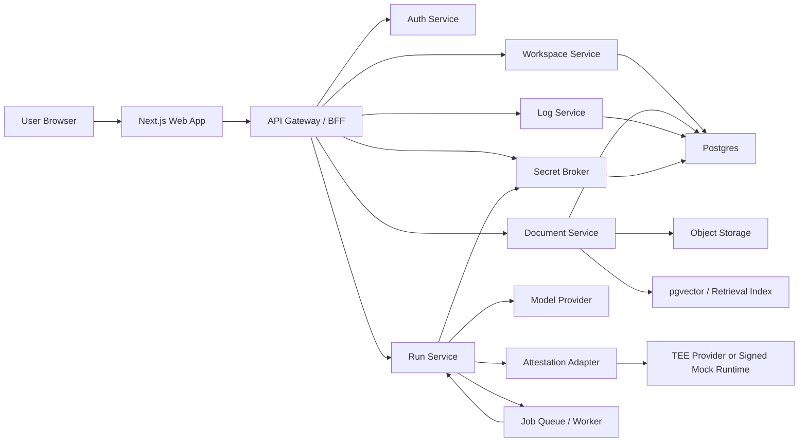

# CohortVault Architecture

## 1. Architecture Goals

The architecture should satisfy four constraints at once:

1. Be buildable in a hackathon
2. Tell a strong TEE-ready story
3. Produce a demo that feels like a real product
4. Avoid fake security claims

## 2. High-Level Design



## 3. Deployment Shape

### Hackathon deployment

- `apps/web`: Vercel or Docker
- `apps/api`: Render, Railway, Fly.io, or Docker VM
- `apps/worker`: same provider as API
- `Postgres + pgvector`: Supabase or Neon
- `Object storage`: Supabase Storage or S3-compatible bucket
- `Redis`: optional, only if background jobs need it

### Post-hackathon upgrade

- Split API and worker
- Use proper vault and KMS
- Add real TEE execution backend
- Add monitoring and policy engine

## 4. Runtime Modes

### Mode A: Standard

- Fast path
- Normal retrieval and LLM call
- Good for non-sensitive content

### Mode B: Secure Run

- Uses restricted tools
- Uses stricter prompt template
- Uses scoped secret delegation
- Produces execution receipt
- Uses attestation adapter

This lets the MVP show a clear product distinction without overbuilding.

## 5. Main Services

## 5.1 Web App

**Responsibilities**

- Authentication UI
- Workspace and file management
- Query and run UI
- Audit log UI
- Attestation card UI

**Tech**

- Next.js App Router
- TypeScript
- Tailwind
- shadcn/ui

## 5.2 API Gateway / BFF

**Responsibilities**

- Session-aware request handling
- Role checks
- Aggregating domain services for the frontend
- Returning shaped data for UI

**Why BFF**

- Keeps frontend simple
- Avoids leaking internal service contracts
- Makes permission logic consistent

## 5.3 Workspace Service

**Responsibilities**

- Workspace CRUD
- Member invites
- Role management
- Workspace policies

## 5.4 Document Service

**Responsibilities**

- Upload file metadata
- Store raw files in object storage
- Parse text from PDFs and markdown
- Chunk and embed content
- Persist embeddings into pgvector

**MVP ingestion pipeline**

1. Upload file
2. Store object
3. Extract text
4. Chunk text
5. Generate embeddings
6. Store chunks and vectors

## 5.5 Run Service

**Responsibilities**

- Receive chat and secure-run requests
- Build prompts
- Retrieve context
- Enforce output mode
- Call model provider
- Persist receipts and logs

**Secure Run extras**

- Allowed-tool list
- Redaction policy
- Secret broker integration
- Attestation adapter call

## 5.6 Secret Broker

**Responsibilities**

- Store encrypted secret references
- Mint short-lived capability tokens for runs
- Proxy secret-backed tool calls
- Prevent raw secret disclosure to frontend

**Important rule**

Secrets are never returned to the client or included in model context as raw values.

## 5.7 Attestation Adapter

**Responsibilities**

- Abstract attestation source
- Return a normalized execution receipt

**Two implementations**

- `MockAttestationAdapter`: signs runtime metadata using a project key
- `RealTEEAttestationAdapter`: fetches quote, measurement, and runtime evidence from dstack or other provider

This keeps the demo honest. The UI can say `attestation-backed` or `signed runtime receipt` depending on the adapter used.

## 5.8 Log Service

**Responsibilities**

- Immutable-style event records for:
  - login
  - file upload
  - workspace change
  - query run
  - secret access
  - revocation

## 6. Core Data Model

## 6.1 Tables

### users

- id
- email
- name
- created_at

### workspaces

- id
- name
- slug
- owner_id
- description
- secure_mode_default
- created_at

### workspace_members

- id
- workspace_id
- user_id
- role
- invited_by
- created_at

### documents

- id
- workspace_id
- filename
- storage_path
- mime_type
- uploaded_by
- status
- created_at

### document_chunks

- id
- document_id
- workspace_id
- chunk_index
- content
- embedding
- token_count

### runs

- id
- workspace_id
- user_id
- mode
- prompt
- output
- status
- redaction_mode
- created_at

### run_sources

- id
- run_id
- document_id
- chunk_id
- citation_text

### secrets

- id
- workspace_id
- name
- provider
- encrypted_blob
- created_by
- revoked_at

### run_receipts

- id
- run_id
- adapter_type
- runtime_id
- policy_hash
- receipt_payload
- signature
- created_at

### audit_events

- id
- workspace_id
- actor_user_id
- event_type
- target_type
- target_id
- payload
- created_at

## 7. Role Model

### Owner

- Full access
- Upload and delete files
- Manage members
- Attach secrets
- See raw citations

### Builder

- Can run standard and secure workflows
- Can only see allowed documents
- May see redacted source snippets

### Reviewer

- Read-only access to selected outputs
- Can inspect receipts and logs
- No raw secret access

## 8. Key Flows

## 8.1 Workspace Creation

1. User signs in
2. Creates workspace
3. API stores workspace and membership
4. UI lands on dashboard

## 8.2 File Upload and Ingestion

1. User uploads file
2. API requests signed upload URL
3. File goes to storage
4. Worker extracts text
5. Worker chunks and embeds
6. Document becomes searchable
7. Audit event recorded

## 8.3 Secure Run

1. User clicks `Run Securely`
2. API checks role and workspace policy
3. Run service retrieves allowed context
4. Secret broker mints scoped capability if needed
5. Attestation adapter records runtime identity
6. Model/tool call executes
7. Output passes redaction filter
8. Receipt and audit events are saved
9. UI shows result plus receipt

## 8.4 Secret Revocation

1. Owner revokes secret
2. Secret row gets revoked timestamp
3. Broker denies future capability minting
4. UI and logs show revocation event

## 9. API Surface

These endpoints are enough for the MVP:

```text
POST   /api/auth/invite/accept
GET    /api/workspaces
POST   /api/workspaces
GET    /api/workspaces/:id
POST   /api/workspaces/:id/invite
PATCH  /api/workspaces/:id/members/:memberId

POST   /api/workspaces/:id/documents/upload-url
POST   /api/workspaces/:id/documents
GET    /api/workspaces/:id/documents
DELETE /api/workspaces/:id/documents/:documentId

POST   /api/workspaces/:id/chat
POST   /api/workspaces/:id/runs/secure
GET    /api/workspaces/:id/runs
GET    /api/workspaces/:id/runs/:runId

POST   /api/workspaces/:id/secrets
POST   /api/workspaces/:id/secrets/:secretId/revoke

GET    /api/workspaces/:id/audit
GET    /api/workspaces/:id/receipts/:runId
```

## 10. Security Model for the Hackathon

### Honest claims

- Workspace isolation is enforced at the application and database layer
- Secrets are encrypted at rest and never exposed to browsers
- Secure Run returns a signed receipt
- Redaction policy can hide raw sources from limited roles

### Explicit limitations

- Mock attestation does not equal hardware-backed confidentiality
- Model provider still receives the final prompt in MVP mode unless deployed inside a true TEE path
- Client-side encryption is not in MVP

## 11. MVP TEE Story

To keep the project credible:

- Do not say `fully private by cryptographic guarantee` unless you actually have it
- Say `TEE-ready architecture with signed runtime receipts in MVP`
- If you connect dstack later, swap the adapter and keep the product surface unchanged

## 12. Recommended Demo Dataset

Use a small but believable dataset:

- One private pitch deck
- One paper summary
- One internal planning memo
- One transcript from a strategy call

Create at least one file that the Builder role cannot fully view but can still query through secure workflows.

## 13. Testing Strategy

### Minimum tests

- Role access test
- File upload test
- Retrieval smoke test
- Secure run receipt generation test
- Secret revocation test

### Demo checks

- Fresh workspace can be created
- Demo files ingest in under 2 minutes
- One secure run succeeds
- One revoked-secret run fails

## 14. Architecture Decisions

### Why Next.js + FastAPI

- Fast frontend iteration
- Clean backend service separation
- Good DX for hackathon pace

### Why pgvector

- One database for app state and retrieval state
- Simpler than adding a separate vector DB

### Why attestation adapter abstraction

- Lets you stay honest in MVP
- Gives a believable path to real TEE integration

## 15. Post-Hackathon Roadmap

- Real TEE remote attestation integration
- Encrypted upload with client-side key wrapping
- Policy engine with approval flows
- Reviewer portal for diligence workflows
- Startup-facing compliance and audit product
