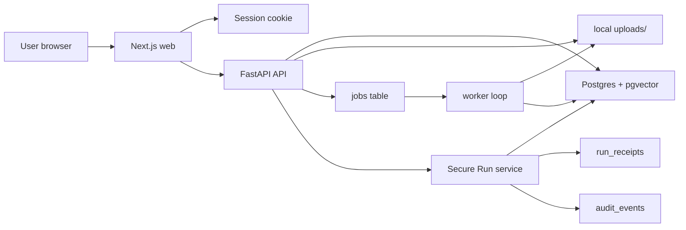

# CohortVault Architecture Diagram

## Submission Notes

- The default implementation now targets Postgres with pgvector for persistence and retrieval.
- The ingestion boundary now matches the architecture docs more closely: API writes documents and queue entries, worker performs extraction and indexing.
- Session switching is cookie-backed, so owner/builder/reviewer views are no longer all the same backend user.
- The repo still keeps sqlite as a smoke-test fallback for machines without a live Postgres service.
- The remaining upgrade path is local uploads -> object storage, demo auth -> real auth, signed receipt -> real TEE adapter.
