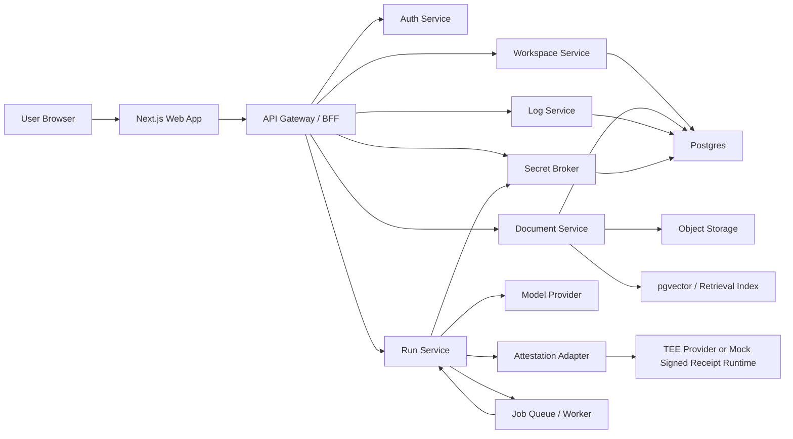

# CohortVault Architecture

## 1. Architecture Goals

The architecture should satisfy four constraints at once:

1. Be buildable in a hackathon
2. Tell a strong TEE-ready story
3. Produce a demo that feels like a real product
4. Avoid fake security claims

## 2. High-Level Design



## 3. Deployment Shape

## 3.1 Current implementation snapshot

The current submission build is narrower than the original blueprint in a few important ways:

- Session handling is a cookie-backed demo actor switch, not a full auth provider
- Document uploads land in local storage and are indexed by a worker into Postgres `document_chunks`
- Secure Run uses live OpenAI chat plus embeddings on the main path
- `run_receipts` now stores signed receipt v1 records from the mock adapter, not hardware attestation or a TEE quote
- Receipt payloads now surface provider metadata separately from policy digest and runtime metadata, so the UI can show `lightweight signed runtime` versus `tee-provider stub` without implying a real quote exists
- Secret values are only encrypted into `encrypted_blob` when `COHORTVAULT_API_SECRET_ENCRYPTION_KEY` is configured
- Reviewer reads now re-apply source redaction at fetch time; full-mode outputs are only fully visible to the run creator or a workspace owner
- Smoke tests and API tests still depend on a reachable Postgres instance

### Hackathon deployment

- `apps/web`: Vercel or Docker
- `apps/api`: Render, Railway, Fly.io, or Docker VM
- `apps/worker`: same provider as API
- `Postgres + pgvector`: Supabase or Neon
- `Object storage`: optional upgrade path; the current submission build uses local disk uploads
- `Redis`: optional, only if background jobs need it

### Post-hackathon upgrade

- Split API and worker
- Use proper vault and KMS
- Add real TEE execution backend
- Add monitoring and policy engine

## 4. Runtime Modes

The original blueprint modeled two runtime modes. The current submission branch exposes the `Secure Run` path in the UI and uses output modes (`summary_only`, `redacted`, `full`) to control what the viewer receives.

### Mode A: Standard

- Fast path
- Normal retrieval and LLM call
- Good for non-sensitive content

### Mode B: Secure Run

- Uses restricted tools
- Uses stricter prompt template
- Uses workspace-scoped secret references with revocation checks
- Produces a signed receipt v1 record
- Uses a mock signed receipt adapter in the current build

This lets the MVP show a clear product distinction without overbuilding.

## 5. Main Services

## 5.1 Web App

**Responsibilities**

- Authentication UI
- Workspace and file management
- Query and run UI
- Audit log UI
- Receipt verification UI

**Tech**

- Next.js App Router
- TypeScript
- Custom CSS plus a small shared UI package

## 5.2 API Gateway / BFF

**Responsibilities**

- Session-aware request handling
- Role checks
- Aggregating domain services for the frontend
- Returning shaped data for UI

**Why BFF**

- Keeps frontend simple
- Avoids leaking internal service contracts
- Makes permission logic consistent

## 5.3 Workspace Service

**Responsibilities**

- Workspace CRUD
- Member invites
- Role management
- Workspace policies

## 5.4 Document Service

**Responsibilities**

- Upload file metadata
- Store raw files in local storage for the current build
- Parse text from PDFs and markdown
- Chunk and embed content
- Persist embeddings into pgvector

**MVP ingestion pipeline**

1. Upload file
2. Store object
3. Extract text
4. Chunk text
5. Generate embeddings
6. Store chunks and vectors

## 5.5 Run Service

**Responsibilities**

- Receive chat and secure-run requests
- Build prompts
- Retrieve context with OpenAI embeddings plus pgvector
- Enforce output mode
- Call OpenAI chat completions on the main path
- Persist signed receipts and logs
- Re-apply output redaction when a reviewer opens a persisted run

**Secure Run extras**

- Redaction policy
- Secret metadata and revocation integration
- Mock signed receipt adapter call

## 5.6 Secret Broker

**Responsibilities**

- Store workspace-scoped secret metadata
- Persist optional encrypted `secretValue` blobs when the server encryption key is configured
- Track revocation and last-used timestamps for runs
- Prevent raw secret disclosure to frontend

**Important rule**

Secrets are never returned to the client or included in model context as raw values.

**Current implementation note**

The current build does not mint capability tokens yet. It stores secret metadata in Postgres, optionally stores `secretValue` as Fernet-encrypted `encrypted_blob`, and enforces revocation during Secure Run.

## 5.7 Attestation Adapter

**Responsibilities**

- Abstract attestation source
- Return a normalized execution receipt

**Two implementations**

- `MockSignedReceiptAdapter`: emits signed receipt v1 with provider type `lightweight signed runtime`
- `TEEProviderStubAdapter`: emits signed receipt v1 with provider type `tee-provider stub`
- `RealTEEAttestationAdapter`: backward-compatible alias for the stub path until a real provider is implemented

This keeps the demo honest. The UI should say `signed receipt v1 (mock adapter)` for the current MVP and reserve `attestation-backed` for a real adapter-backed path.

## 10.1 What the current receipt can prove

- The receipt payload integrity is verifiable with the configured application signing key
- The payload binds `providerInfo`, `runtimeMetadata`, `policyHash`, and `sourceScopeHash` into one signed record
- The current provider type is explicit, so the UI can distinguish a lightweight signed runtime from a TEE-ready stub

## 10.2 What the current receipt cannot prove

- It cannot prove execution inside SGX, Nitro Enclaves, dstack, or any other TEE
- It does not produce or verify a quote, PCR measurement, enclave report, or similar hardware evidence
- Selecting `tee-provider stub` does not upgrade the trust model; it only exercises the provider abstraction layer

## 5.8 Log Service

**Responsibilities**

- Immutable-style event records for:
  - login
  - file upload
  - workspace change
  - query run
  - secret access
  - revocation

## 6. Core Data Model

## 6.1 Tables

### users

- id
- email
- name
- created_at

### workspaces

- id
- name
- slug
- owner_id
- description
- secure_mode_default
- created_at

### workspace_members

- id
- workspace_id
- user_id
- role
- invited_by
- created_at

### documents

- id
- workspace_id
- filename
- storage_path
- mime_type
- uploaded_by
- status
- created_at

### document_chunks

- id
- document_id
- workspace_id
- chunk_index
- content
- embedding
- token_count

### runs

- id
- workspace_id
- user_id
- mode
- prompt
- output
- status
- redaction_mode
- created_at

### run_sources

- id
- run_id
- document_id
- document_name
- visibility
- snippet
- redacted

### secrets

- id
- workspace_id
- name
- provider
- encrypted_blob
- created_by
- revoked_at

### run_receipts

- run_id
- adapter_type
- runtime_id
- policy_hash
- sources_touched
- secret_accessed
- receipt_payload
- signature
- signature_algorithm
- source_scope
- signed_at

### audit_events

- id
- workspace_id
- actor_user_id
- event_type
- target_type
- target_id
- payload
- created_at

## 7. Role Model

### Owner

- Full access
- Upload and delete files
- Manage members
- Attach secrets
- See raw citations

### Builder

- Can run standard and secure workflows
- Can only see allowed documents
- May see redacted source snippets

### Reviewer

- Read-only access to selected outputs
- Can inspect receipts and logs
- No raw secret access
- Full-mode outputs are re-redacted unless the reviewer is also the run creator or a workspace owner

## 8. Key Flows

## 8.1 Workspace Creation

1. User signs in
2. Creates workspace
3. API stores workspace and membership
4. UI lands on dashboard

## 8.2 File Upload and Ingestion

1. User uploads file
2. API writes the file into local storage for the current build
3. API inserts a queued ingestion job
4. Worker extracts text
5. Worker chunks and embeds
6. Document becomes searchable
7. Audit event recorded

## 8.3 Secure Run

1. User clicks `Run Securely`
2. API checks role and workspace policy
3. Run service retrieves allowed context
4. Secret metadata is checked and revocation is enforced
5. OpenAI chat generates the answer from the retrieved context
6. Signed receipt v1 metadata is recorded
7. Output passes redaction filter
8. Receipt and audit events are saved
9. UI shows result plus receipt

## 8.4 Secret Revocation

1. Owner revokes secret
2. Secret row gets revoked timestamp
3. Broker denies future capability minting
4. UI and logs show revocation event

## 9. API Surface

These are the implemented MVP endpoints today:

```text
GET    /api/v1/session
POST   /api/v1/session/actor
GET    /api/v1/workspaces
POST   /api/v1/workspaces
GET    /api/v1/workspaces/:id
GET    /api/v1/workspaces/:id/members
POST   /api/v1/workspaces/:id/invite
PATCH  /api/v1/workspaces/:id/members/:memberId

POST   /api/v1/workspaces/:id/documents
GET    /api/v1/workspaces/:id/documents
POST   /api/v1/workspaces/:id/documents/:documentId/reindex
DELETE /api/v1/workspaces/:id/documents/:documentId

POST   /api/v1/workspaces/:id/runs/secure
GET    /api/v1/workspaces/:id/runs
GET    /api/v1/workspaces/:id/runs/:runId

GET    /api/v1/workspaces/:id/secrets
POST   /api/v1/workspaces/:id/secrets
POST   /api/v1/workspaces/:id/secrets/:secretId/revoke

GET    /api/v1/workspaces/:id/audit
GET    /api/v1/workspaces/:id/receipts/latest
GET    /api/v1/workspaces/:id/receipts/:runId
```

## 10. Security Model for the Hackathon

### Honest claims

- Workspace isolation is enforced at the application and database layer
- Secrets are never exposed to browsers; actual at-rest encryption for `secretValue` only happens when the server encryption key is configured
- Secure Run returns a signed receipt v1 record with adapter metadata, policy hash, source scope, and signature
- Reviewer reads re-apply source redaction for the current viewer

### Explicit limitations

- Mock signed receipts do not equal hardware-backed confidentiality or remote attestation
- Model provider still receives the final prompt in MVP mode unless deployed inside a true TEE path
- Full-mode answers are persisted as run artifacts and are only fully visible to the creator or workspace owner
- Client-side encryption is not in MVP

## 11. MVP TEE Story

To keep the project credible:

- Do not say `fully private by cryptographic guarantee` unless you actually have it
- Say `TEE-ready architecture with signed receipt v1 and explicit provider metadata in MVP`
- If you connect dstack later, swap the adapter and keep the product surface unchanged

## 12. Recommended Demo Dataset

Use a small but believable dataset:

- One private pitch deck
- One paper summary
- One internal planning memo
- One transcript from a strategy call

Create at least one file that the Builder role cannot fully view but can still query through secure workflows.

## 13. Testing Strategy

### Minimum tests

- Role access test
- File upload test
- Retrieval smoke test
- Secure run receipt generation test
- Secret revocation test
- Reviewer re-redaction test for persisted run sources

### Demo checks

- Fresh workspace can be created
- Demo files ingest in under 2 minutes
- One secure run succeeds
- One revoked-secret run fails
- A reviewer cannot recover raw snippets from another member's full-mode run

## 14. Architecture Decisions

### Why Next.js + FastAPI

- Fast frontend iteration
- Clean backend service separation
- Good DX for hackathon pace

### Why pgvector

- One database for app state and retrieval state
- Simpler than adding a separate vector DB

### Why attestation adapter abstraction

- Lets you stay honest in MVP
- Gives a believable path to real TEE integration

## 15. Post-Hackathon Roadmap

- Real TEE remote attestation integration
- Encrypted upload with client-side key wrapping
- Policy engine with approval flows
- Reviewer portal for diligence workflows
- Startup-facing compliance and audit product
