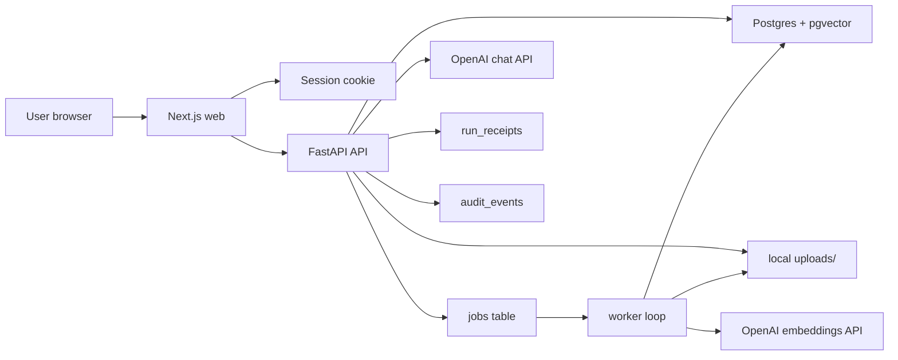

# CohortVault Architecture Diagram

## Submission Notes

- The default implementation now targets Postgres with pgvector for persistence and retrieval.
- The ingestion boundary now matches the architecture docs more closely: API writes documents and queue entries, worker performs extraction and indexing.
- Session switching is cookie-backed, so owner/builder/reviewer views are no longer all the same backend user.
- Secure Run uses live OpenAI chat calls on the main path, and worker ingestion uses OpenAI embeddings when configured.
- `run_receipts` now store signed receipt v1 records from the mock adapter, including payload, signature, policy hash, and source scope. They are not hardware attestation or TEE quotes.
- The remaining upgrade path is local uploads -> object storage, demo auth -> real auth, mock signed receipt -> TEE-backed evidence.
