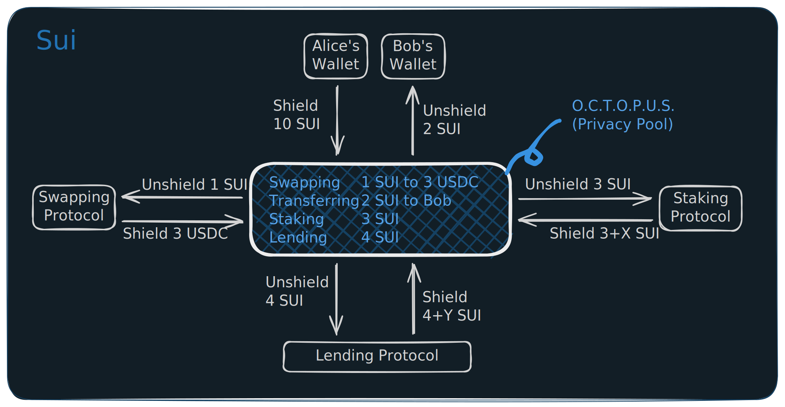
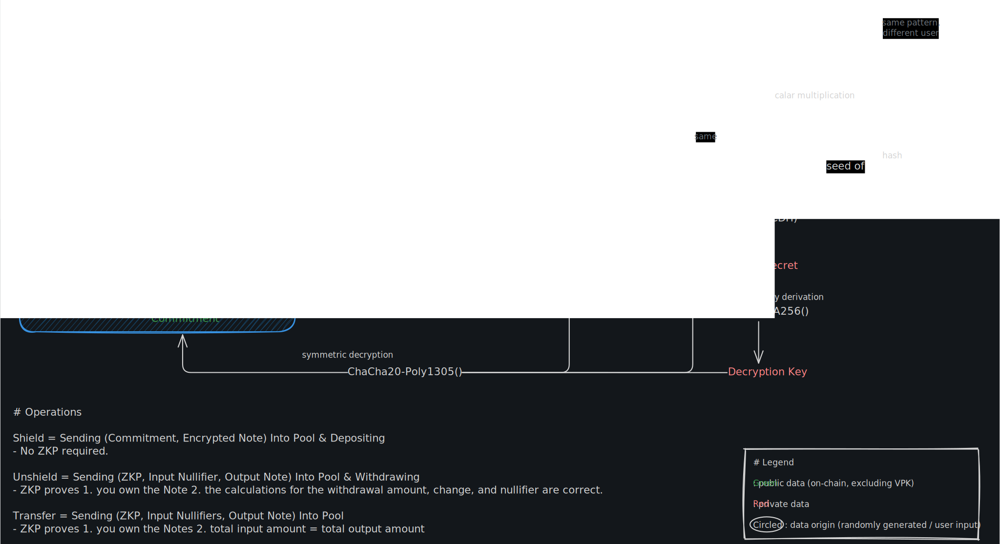

# Octopus - On-Chain Transaction Obfuscation Protocol Underlying Sui

## Description

A privacy layer for Sui that lets users transact and DeFi without leaking amounts, counterparties, or chain-of-custody. Tokens deposited into a shared privacy pool become Groth16 ZK-SNARK commitments that hide both amount and token type; spends prove ownership without revealing which deposit moved. Nullifiers stop double-spends and a Merkle anonymity set keeps every interaction visually identical on-chain — Sui's transparent ledger gets a cryptographically-guaranteed cloak.

**OCTOPUS** stands for **On-Chain Transaction Obfuscation Protocol Underlying Sui**.

A privacy protocol implementation for the Sui blockchain, enabling shielded transactions using zero-knowledge proofs.

## Overview



Octopus enables private token operations on Sui by implementing a UTXO-based privacy pool with Groth16 ZK-SNARKs verification. Users can:

- **Shield**: Deposit tokens into the privacy pool, creating encrypted notes
  - Shield = Sending (Commitment, Encrypted Note) Into Pool & Depositing
  - No ZKP required.
- **Unshield**: Withdraw tokens with ZK proof verification and automatic change handling
  - Sending (ZKP, Input Nullifiers, Output Note) Into Pool & Withdrawing
  - ZKP proves
    1. you own the Note(s) (1 or 2 input notes supported)
    2. the calculations for the withdrawal amount, change, and nullifiers are correct.
- **Transfer**: Send tokens privately to other users within the pool
  - Sending (ZKP, Input Nullifiers, Output Notes) Into Pool
  - ZKP proves
    1. you own the Notes (2-input, 2-output UTXO model)
    2. total input amount = total output amount
- **Swap**: Exchange tokens privately through integrated DEXs (DeepBook V3 Mainnet only)

## Design & References

Octopus builds upon proven privacy protocols while introducing innovations for the Sui ecosystem. The UTXO-based privacy pool design is inspired by **Tornado Cash** and **Zcash**, while the viewing key mechanism follows **Zcash's** selective disclosure model. Future milestones will incorporate relayer network patterns from **Railgun** and **Tornado Cash** (Milestone 3), and compliance features like **Railgun's Private Proofs of Innocence** (Milestone 4).

**Key Innovations:**

- **Sui Blockchain Integration**: First privacy protocol on Sui, leveraging Move language for on-chain proof verification
- **Private DEX Swaps**: ZK circuit integration with DeepBook for privacy-preserving token exchanges
- **Modern Cryptographic Stack**: ChaCha20-Poly1305 AEAD encryption with HKDF-SHA256 key derivation
- **Automatic Change Handling**: Built-in change note creation in unshield/transfer/swap operations to prevent fund loss

### Cryptographic Primitives



```txt
nullifying_key = Poseidon(spending_key, 1)
MPK = Poseidon(spending_key, nullifying_key)   // Master Public Key
NSK = Poseidon(MPK, random)                    // Note Secret Key
commitment = Poseidon(NSK, token, amount)      // Note Commitment
nullifier = Poseidon(nullifying_key, leaf_index) // Prevents double-spend

// Viewing Keys
viewing_private_key = X25519(SHA256(spending_key))
viewing_public_key = X25519.publicKey(viewing_private_key)
```

- **`Spending Key`**: A private key that proves ownership of a note and authorizes spending it. It must be kept secret.
- **`Nullifying Key`**: A private key used to generate a unique `nullifier` for each spent note, preventing double-spends. It must be kept secret.
- **`MPK (Master Public Key)`**: A public key derived from the spending and nullifying keys, serving as the root of a user's identity within the protocol.
- **`Viewing Key`**: A key that grants read-only access to transaction details. See the "Security Considerations" section for details on its two forms (personal vs. third-party).

## Quick Start

### Prerequisites

- [Sui CLI](https://docs.sui.io/guides/developer/getting-started/sui-install) >= 1.64.0
- [Node.js](https://nodejs.org/) >= 18
- [Circom](https://docs.circom.io/getting-started/installation/) >= 2.1.0

### 1. Build Circuits

```bash
cd circuits
npm install
./scripts/compile.sh
```

This generates for each circuit:

- `build/{circuit}_js/{circuit}.wasm` - Circuit WASM
- `build/{circuit}_final.zkey` - Proving key (9-10 MB)
- `build/{circuit}_vk.json` - Verification key

### 2. Build & Test Move Contracts

```bash
cd contracts
sui move build
sui move test
```

Expected output: **28 tests passing**

Reference [contracts/README.md](contracts/README.md) for deployment guides.

### 3. Build SDK (Required for Frontend)

```bash
cd sdk
npm install
npm run build
```

This generates the SDK TypeScript library that the frontend depends on.

### 4. Run Frontend (Web UI)

> **Environment Setup**: The frontend reads contract addresses from `frontend/.env`.
> Copy the example file and fill in any values you need to override:
>
> ```bash
> cp frontend/.env.example frontend/.env
> ```

```bash
cd frontend
npm install
npm run dev
```

Open <http://localhost:3000> to access the web interface.

**Features:**

- **Multi-keypair management**: Store and switch between multiple privacy keypairs
- **Note scanning**: Background worker scans blockchain for your encrypted notes
- **Real-time balances**: Automatically computed from unspent notes
- **Shield/Unshield**: Deposit and withdraw with ZK proofs
- **Private transfers**: Send tokens to other users (2-input, 2-output)
- **Swap UI**: Token exchange interface with DeepBook V3 integration

### 5. Run Relayer (Recommended for Full Privacy)

The relayer submits transactions on behalf of users so the gas payer address is hidden from on-chain observers. Without a relayer, all operations (shield, unshield, transfer, swap) still work — the user's wallet signs and pays gas directly — but the wallet address becomes linkable to the private transaction on-chain. A single relayer instance serves both mainnet and testnet.

**Setup:**

```bash
cd relayer
npm install
cp relayer/.env.example relayer/.env
```

Configure environment variables in `relayer/.env`:

```bash
# Per-network Ed25519 keypairs — fund these addresses with SUI (and DEEP for swaps)
MAINNET_RELAYER_PRIVATE_KEY=
TESTNET_RELAYER_PRIVATE_KEY=

# Allowed CORS origins (comma-separated). Only these origins may call the relayer from a browser.
# In production, requests without a matching Origin header are also blocked.
ALLOWED_ORIGINS=http://localhost:3000,https://www.sui-octopus.com/
```

**Run:**

```bash
# Development (with hot reload)
npm run dev

# Production
npm run build && npm start
```

**API Endpoints:**

| Method  | Path                                     | Description                                              |
| ------- | ---------------------------------------- | -------------------------------------------------------- |
| `GET`   | `/relayer-info`                          | Returns relayer addresses and status for both networks   |
| `GET`   | `/fee-quote?network=<mainnet\|testnet>`  | Returns current fee quote                                |
| `POST`  | `/submit/transfer`                       | Submit a private transfer                                |
| `POST`  | `/submit/unshield`                       | Submit an unshield (withdrawal)                          |
| `POST`  | `/submit/swap`                           | Submit a private swap                                    |

All submit endpoints require a `"network": "mainnet" | "testnet"` field in the request body.

**Frontend Integration:**

Point the frontend to your relayer by setting these env vars before running `npm run dev`:

```bash
NEXT_PUBLIC_TESTNET_RELAYER_URL=http://localhost:8080
NEXT_PUBLIC_MAINNET_RELAYER_URL=https://your-relayer.example.com
```

Users can also configure and enable the relayer per-network from the UI's relayer settings panel.

## Acknowledgments

**Disclosure**: This project was developed in collaboration with AI tools, primarily using Gemini for data search, research, and integration, and using Claude Code for architecture design, code implementation, and documentation organization.

## License

MIT
